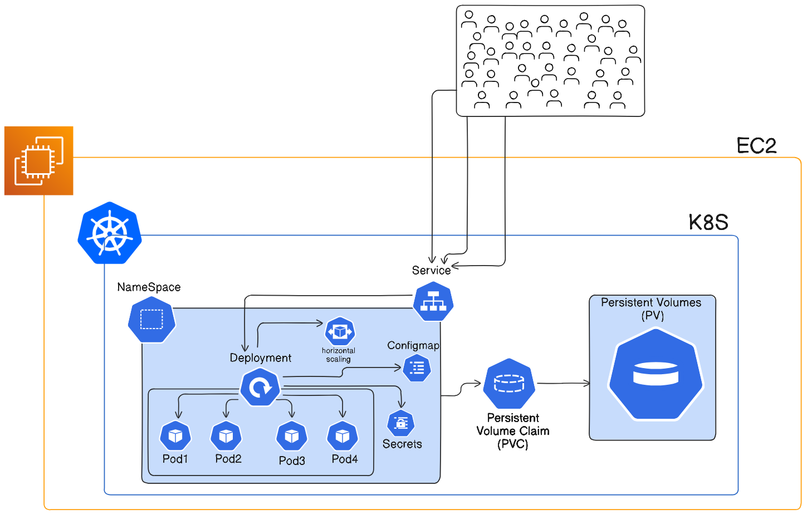

# Kubernetes HPA Deployment (React + Django + MySQL)

This project shows how to deploy a **React/Django app with a MySQL database on Kubernetes**, featuring **Horizontal Pod Autoscaling (HPA)** to handle traffic spikes automatically.

It is designed to work on **EKS, EC2 clusters, Minikube, K3s, or MicroK8s**.

---

## Architecture

This setup uses a **multi-container pod (Three tier architecture)**:

### 1. App Container
* **Image**: `rohitxten/react-django-app`
* **Port**: `8000`
* **Function**: Handles frontend and backend logic.

### 2. Database Container
* **Image**: `mysql:8.0`
* **Access**: Accessible via `localhost:3306` from the app container.
* **Storage**: Uses Persistent Volume (PV) and PVC to ensure data persistence across restarts.

### 3. Autoscaling
* **HPA Config**: Scales pods between **1 and 5** replicas.
* **Trigger**: 80% CPU or Memory utilization.



---

## File Structure
```bash
tree
.
├── configmap.yml               # App config (DB name, etc.)
├── deployment.yml              # Main deployment (App + MySQL)
├── hpa.yml                     # Horizontal Pod Autoscaler configuration
├── namespace.yml               # Namespace definition
├── persistent-volume.yml       # Physical storage definition
├── persistent-volume-claim.yml # Storage request (PVC)
├── secret.yml                  # DB passwords (Secrets)
└── service.yml                 # Service exposure
```

---

## Deployment Guide (Fresh EC2 / kind)

This guide assumes you are using an **Ubuntu EC2 instance (20.04/22.04)** with SSH access and outgoing internet access.

### Step 0: Connect to EC2
**Security Group**
| Type           | Port                              |
| -------------- | --------------------------------- |
| SSH            | 22                                |
| HTTP           | 80                                |
| HTTPS          | 443                               |
| NodePort range | 30000-32767 (optional but useful) |
```bash
#connect to EC2 from local machine
ssh -i your-key.pem ubuntu@your-ec2-public-ip
```

 
### Step 1: System Update & Docker Installation

Kind requires Docker to run.

```bash
# Update system
sudo apt update && sudo apt upgrade -y

# Install Docker
sudo apt install -y docker.io

# Enable and start Docker
sudo systemctl start docker
sudo systemctl enable docker

# Allow current user to run Docker (avoids sudo in future)
sudo usermod -aG docker $USER
```
*> **Note**: You must log out and log back in for the user group changes to take effect.*

### Step 2: Install Tools (`kubectl` & `kind`)

**Install kubectl:**
```bash
sudo apt install -y apt-transport-https ca-certificates curl
curl -LO "https://dl.k8s.io/release/$(curl -L -s https://dl.k8s.io/release/stable.txt)/bin/linux/amd64/kubectl"
chmod +x kubectl
sudo mv kubectl /usr/local/bin/
```

**Install kind:**
```bash
curl -Lo ./kind https://kind.sigs.k8s.io/dl/latest/kind-linux-amd64
chmod +x kind
sudo mv kind /usr/local/bin/
```

### Step 3: Create Cluster

Create a local Kubernetes cluster using Kind.

```bash
kind create cluster --name demo-cluster
kubectl get nodes
```

### Step 4: Install Metrics Server (Critical for HPA)

The Metrics Server is required for the HPA to read CPU/Memory stats.

```bash
# Install Metrics Server
kubectl apply -f https://github.com/kubernetes-sigs/metrics-server/releases/latest/download/components.yaml

# Patch for Kind/Minikube (Allow insecure TLS)
kubectl -n kube-system edit deployment metrics-server
```
*> Add these flags under `spec.containers.args`:*
```yaml
- --kubelet-insecure-tls
- --kubelet-preferred-address-types=InternalIP,Hostname,ExternalIP
```

Verify installation:
```bash
kubectl get deployment metrics-server -n kube-system
```

### Step 5: Upload & Deploy Project

**1. Copy files to server (Local Machine -> EC2):**
```bash
ssh -i your-key.pem ubuntu@your-ec2-public-ip

```

**2. SSH and Enter Folder:**
```bash
cd your-project-folder
```

**3. Apply Configuration & Storage:**
```bash
kubectl apply -f namespace.yml
kubectl apply -f secret.yml
kubectl apply -f configmap.yml
kubectl apply -f persistent-volume.yml
kubectl apply -f persistent-volume-claim.yml
```
*> Check PVC status: `kubectl get pvc -n react-django-app-demo`*

**4. Deploy Application:**
```bash
kubectl apply -f deployment.yml
kubectl apply -f service.yml
```

### Step 6: Enable Autoscaling

```bash
kubectl apply -f hpa.yml
```

Verify HPA status (it may take a few minutes to calculate):
```bash
kubectl get hpa -n react-django-app-demo
```

---

## Access the Application

Since Kind runs in a local Docker container, it doesn't provide a public LoadBalancer IP automatically. Use port-forwarding to access it.

```bash
# Forward port 8000 from the service to your VM's port 8000
kubectl port-forward service/react-django-app-service 8000:80 -n react-django-app-demo
```

Now access it in your browser:
`http://<EC2-PUBLIC-IP>:8000`

---

##  Troubleshooting

| Issue | Cause | Solution |
|-------|-------|----------|
| **HPA shows `<unknown>`** | Metrics Server not active | Check logs: `kubectl logs -n kube-system deployment/metrics-server`. Improve startup args (Step 4). |
| **Pods stuck in `Pending`** | Storage/PVC issue | Check `kubectl get pvc`. Ensure the `hostPath` in `persistent-volume.yml` exists on the node (`mkdir -p /mnt/data`). |
| **DB Connection Fails** | Host mismatch | Since MySQL is a sidecar, ensure `DB_HOST` is set to `localhost`. |
| **Can't access app** | Security Group / Port Forward | Ensure AWS Security Group allows port 8000 (or whichever you are using) and port-forward command is running. |
