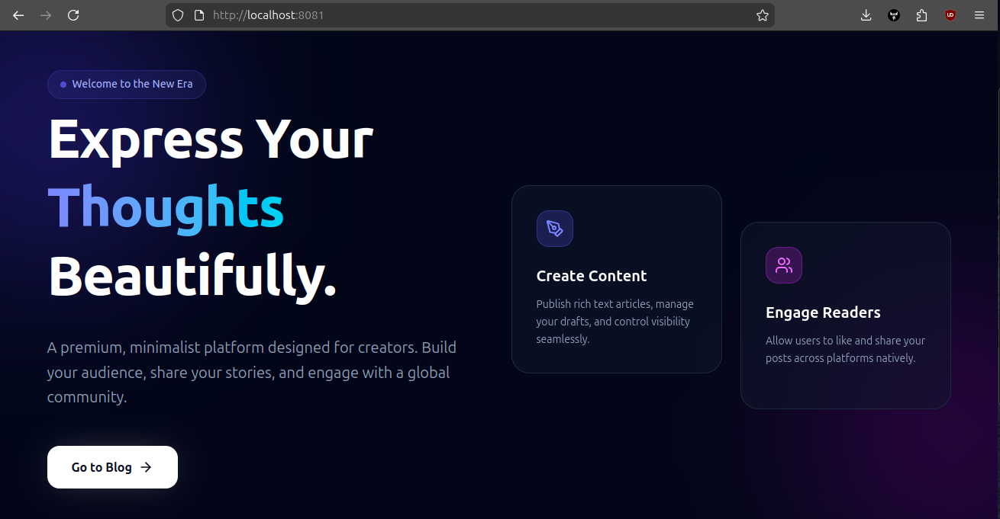
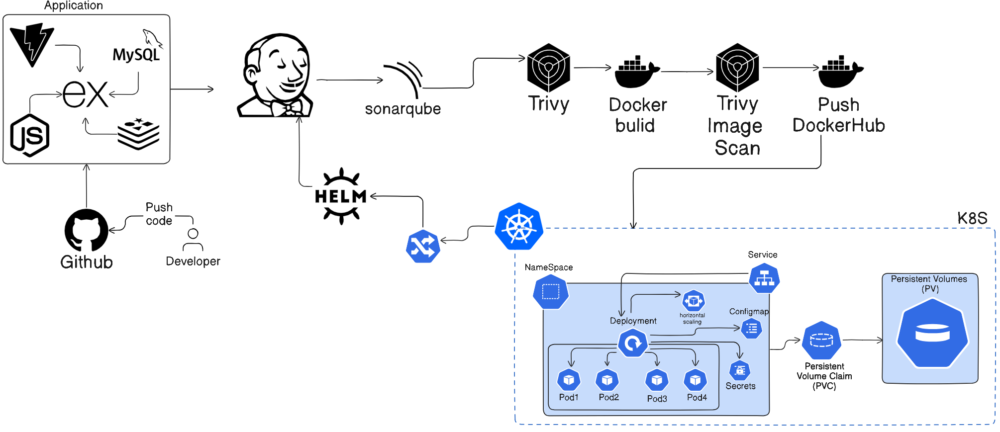

# Micro Blog - Cloud-Native Architecture

This repository contains a full production-ready microservices architecture for a Mini Blog application leveraging React, Node.js, MySQL, and Redis. It features zero-downtime rolling updates, Horizontal Pod Autoscaling, tight NetworkPolicy security, and fully multi-staged non-root Docker builds.

## Home Page Overview


## Architecture Overview

The system is designed as a distributed cloud-native application:



---

## Running the Application From Scratch

Follow these instructions to build the Docker images and deploy the entire stack using Helm onto a local Minikube cluster.

### Prerequisites
- Docker
- Minikube
- Kubectl
- Helm
- Jenkins (with SonarQube & Trivy integrations configured for the CI/CD pipeline)

### 1. Start the Cluster
```bash
# Start Minikube with required add-ons
minikube start --addons=ingress,metrics-server --memory=4096 --cpus=4
```

### 2. Build the Docker Images
Run these commands from the root of the project to build the frontend and backend images locally and load them into Minikube.

```bash
# Build the frontend image
docker build -t myrepo/microservice-frontend:latest ./frontend

# Build the backend image
docker build -t myrepo/microservice-backend:latest ./backend

# Build the seed database image (Optional, if using custom seeding)
docker build -t microdb-seed:latest ./seed

# Load images into Minikube so Kubernetes can access them without pulling from DockerHub
minikube image load myrepo/microservice-frontend:latest
minikube image load myrepo/microservice-backend:latest
minikube image load microdb-seed:latest
```

### 3. Deploy the Application via Helm
The `microapp` Helm chart dynamically provisions all Deployments, Services, HPAs, PDBs, and Ingress rules.

```bash
# Create the production namespace and install the Helm chart
helm upgrade --install microapp ./helm/microapp -n prod --create-namespace \
    --set frontend.image.repository=myrepo/microservice-frontend \
    --set frontend.image.tag=latest \
    --set backend.image.repository=myrepo/microservice-backend \
    --set backend.image.tag=latest \
    --set mysql.image.repository=microdb-seed \
    --set mysql.image.tag=latest
```

### 4. Configure Local DNS
To access the application via a browser, map the cluster IP to the domain defined in the Ingress file.

```bash
# Get the minikube IP
minikube ip

# Add this line to your /etc/hosts file (Linux/Mac) or C:\Windows\System32\drivers\etc\hosts (Windows)
# <minikube-ip> myapp.k8s.local
echo "$(minikube ip) myapp.k8s.local" | sudo tee -a /etc/hosts
```

### 5. Access the Application
Open your browser and navigate to:
**http://localhost:(PORT)/**

---

## Testing Resilience and Scalability

### 1. Load Testing & Autoscaling (HPA)
The Backend and Frontend are configured to scale automatically if CPU utilization exceeds 70%.
```bash
# In Terminal 1: Watch the autoscaler
kubectl get hpa -n prod -w

# In Terminal 2: Generate load (using Hey or Apache Bench)
hey -z 2m -c 50 http://myapp.k8s.local/api/users
```
**Observation**: The HPA will realize CPU limits are consistently being exceeded and scale `replicas` up to a maximum of 10. Once load stops, it will cool down and drop back to 3.

### 2. Zero Downtime Rolling Updates (Blue/Green simulated)
Rolling updates are configured with `maxSurge: 1` and `maxUnavailable: 0`. During an upgrade, there will NEVER be less than 3 pods serving traffic.
```bash
# 1. Trigger an image update
helm upgrade microapp ./helm/microapp -n prod --set backend.image.tag=v2

# 2. Watch the pods launch and terminate gracefully one by one
kubectl get pods -n prod -w

# 3. Check Rollout Status
kubectl rollout status deployment/microapp-backend -n prod
```

### 3. Self-Healing & Pod Restarts
Kubernetes continuously asserts the desired state in the Deployments.
```bash
# 1. Kill a random backend pod
kubectl delete pod -l app=backend -n prod

# 2. Watch the cluster immediately provision a new pod to match the desired replica=3
kubectl get pods -n prod
```

---

## 🛠 Troubleshooting Guide

1. **CrashLoopBackOff on Backend Pods**:
   - Check the logs to see if it's failing to connect to the database.
   - `kubectl logs -l app=backend -n prod`
   - Ensure the MySQL `StatefulSet` is running.

2. **Pending Pods**:
   - Check if the Node is out of resources or if a PersistentVolumeClaim is unfulfilled.
   - `kubectl describe pod <pod-name> -n prod`

3. **502 Bad Gateway / Ingress errors**:
   - The ingress controller cannot reach the `frontend-svc` or `backend-svc`. Ensure probes are passing.
   - Run `kubectl get endpoints -n prod` to ensure that IPs are bounded to the services.

4. **Debugging Network Policies**:
   - If frontend cannot hit the backend API, ensure the labels line up precisely with what is defined in `k8s/security.yaml`. Drop into the container for tests:
   - `kubectl exec -it <frontend-pod> -n prod -- wget http://microapp-backend-svc:3000/health`

   ## Home Page

   The Home (Landing) page is the public-facing entrypoint for the application and is served at the root path `/` by the frontend. It's implemented as a dark, glassmorphic React page built with Tailwind CSS and Lucide-React icons. Key elements:

   - Hero section with a prominent call-to-action to enter the blog.
   - Feature highlights and short preview of latest posts.
   - Responsive layout optimized for desktop and mobile.
   - Client-side routing navigates to the Blog Feed/Create views.

   Developers: `frontend/src/components/Landing.jsx` contains the landing page component and styles are in `frontend/src/index.css`.

   ## Workflow

   This project uses a CI/CD pipeline (Jenkins) to run static analysis, container image builds, security scanning, and Helm deployments.

   - Pipeline steps (typical):
      - Checkout source, run linting and unit tests.
      - Static analysis with SonarQube.
      - Container image build (`docker build`) for `frontend` and `backend`.
      - Image scanning with Trivy and publishing to the registry.
      - Helm chart packaging and `helm upgrade --install` to the target cluster/namespace.

   - Quick local deploy commands:

   ```bash
   # Build images
   docker build -t myrepo/microservice-frontend:latest ./frontend
   docker build -t myrepo/microservice-backend:latest ./backend

   # Load into Minikube (if using Minikube)
   minikube image load myrepo/microservice-frontend:latest
   minikube image load myrepo/microservice-backend:latest

   # Deploy via Helm
   helm upgrade --install microapp ./helm/microapp -n prod --create-namespace \
      --set frontend.image.repository=myrepo/microservice-frontend \
      --set frontend.image.tag=latest \
      --set backend.image.repository=myrepo/microservice-backend \
      --set backend.image.tag=latest
   ```

   For CI: ensure Jenkins is configured to trigger on PRs/branch merges; include SonarQube and Trivy stages and fail the pipeline on critical findings.
